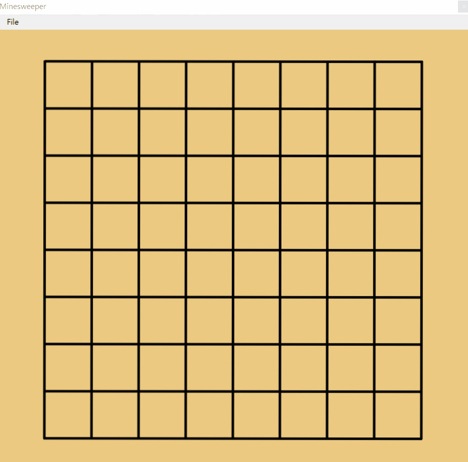

# Csharp_Minesweeper(踩地雷)
利用物件導向的概念設計此專案

# 程式設計流程
1. 利用Windows Form設計遊戲介面
2. 建立各格子的物件，並利用亂數跑出10組數值，表示幾組物件有地雷
3. 計算座標，並利用游標的改變告知使用者哪邊可踩及哪邊不可踩
4. 若踩到沒地雷之物件，則計算周圍有多少地雷，並顯示地雷數量
5. 若踩到地雷，顯示Game over及所有地雷所在位置

